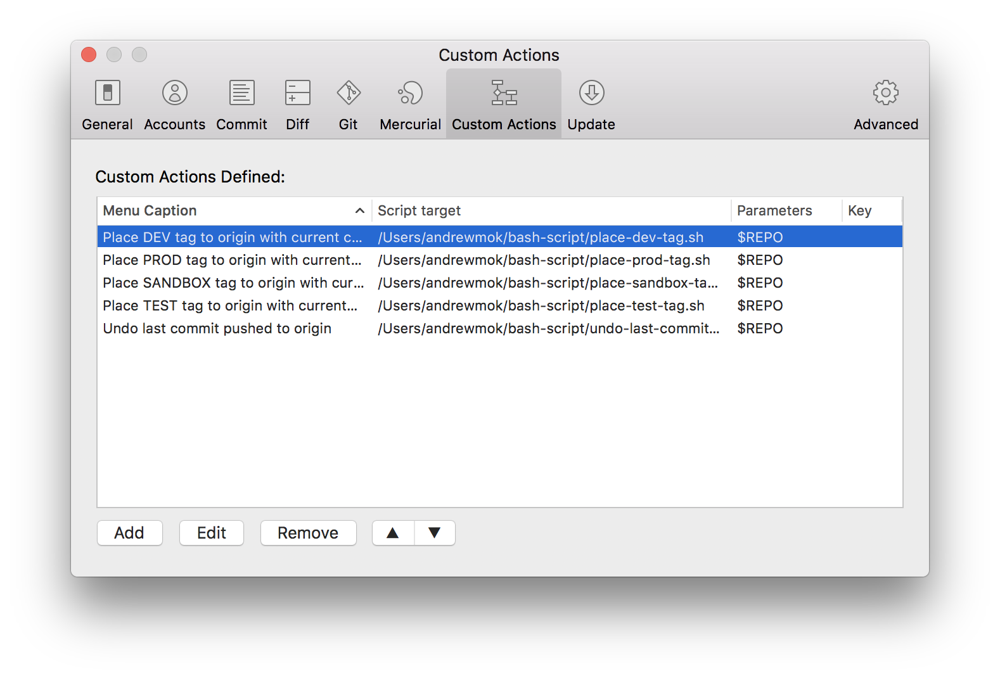

# Andrew Mok's SourceTree custom actions

This is a collection of shell scripts for SourceTree custom actions. It extends the SourceTree functionalities without keep typing `git` commands in CLI.

## Get started

1. Clone the repo, and run
``` bash
chmod -R 0755 .
```
2. Open SourceTree, go to `Preferences` > `Custom Actions`. You can add, edit or remove custom actions.


## Functionality
###### fetch-tags-(origin/upstream).sh
Fetch tags from `origin/upstream`.

##### force-push-(origin/upstream).sh
Force push current branch to `origin/upstream`. IMPORTANT: Remote branch will be replaced.

##### move-(origin/upstream)-(dev/test/sandbox/staging/canary/prod/release).sh
Move `dev/test/sandbox/staging/prod` tag to current commit, and push it to `origin/upstream`.
Parameters: `$SHA`

##### undo-(origin/upstream).sh
Undo commit pushed to `origin/upstream`. IMPORTANT: All changes will be lost.

## Author
- [Andrew Mok](https://andrewmmc.com) (@andrewmmc)

## License
- [Apache License 2.0](LICENSE.md)

## Support
- Give this repo a **star** if you like :)
- For any questions, please feel free to [open an issue here](../../issues) or [contact me via email](mailto:hello@andrewmmc.com).